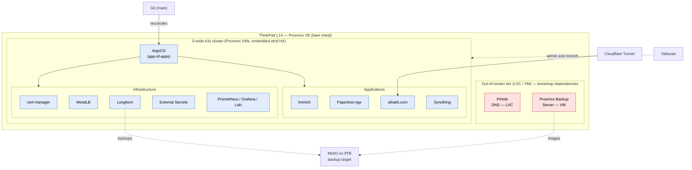
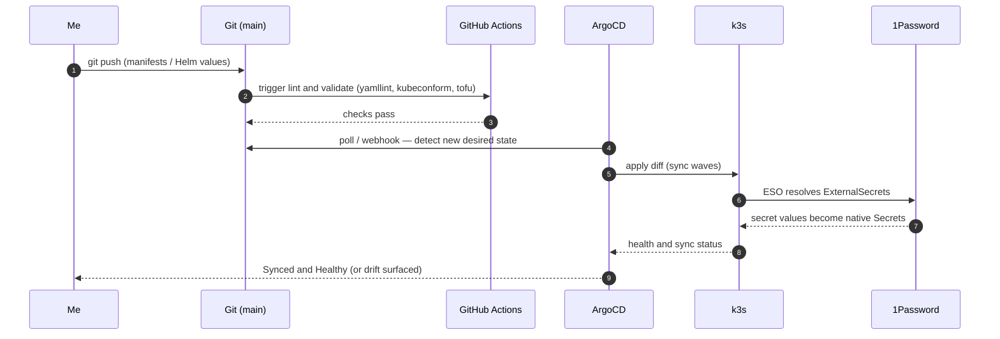
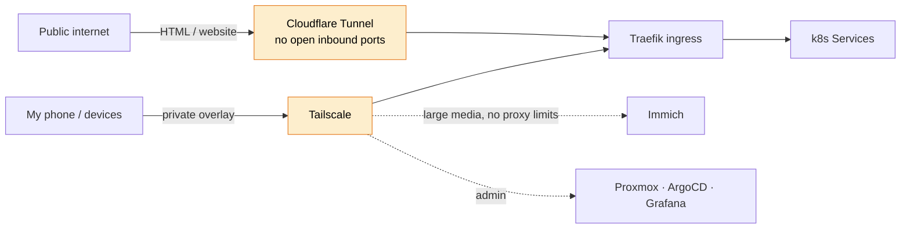
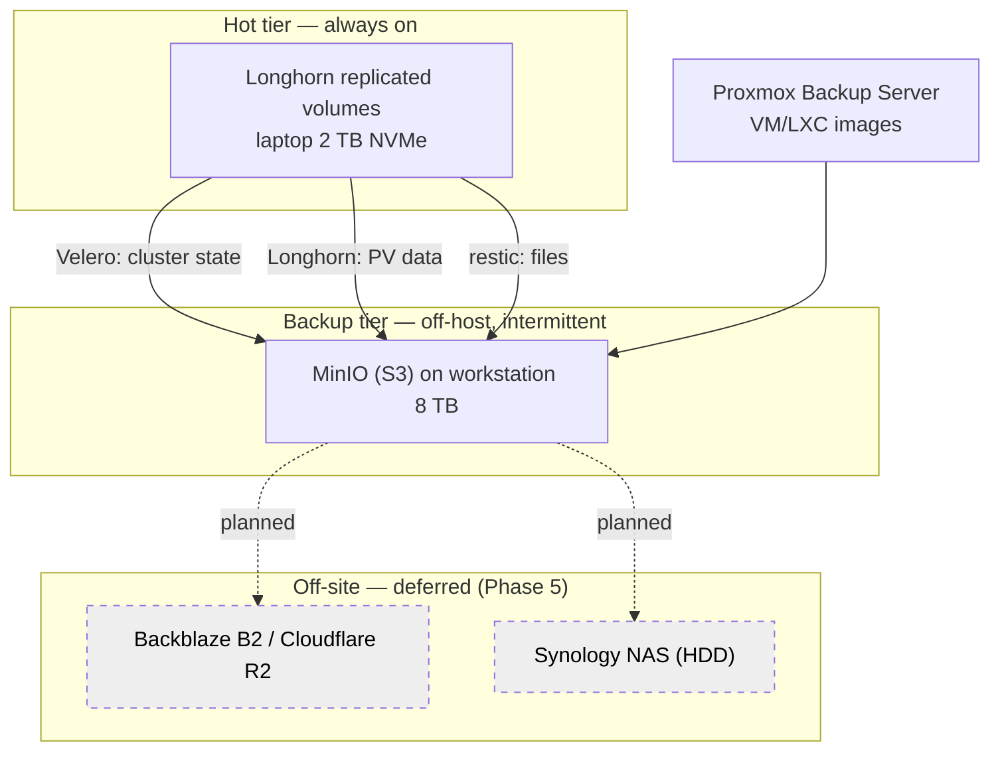

<div align="center">

# Homelab

**A single ThinkPad, run like a production platform.**

Everything declarative, everything in Git, every decision written down.


</div>

---

## What this is

This repository is the complete declarative definition of my homelab, along with the reasoning behind it. It runs the services I use day to day (photos, documents, my website, DNS) and is built like a small production platform: provisioned with Infrastructure as Code, configured with Ansible, and operated through GitOps. Nothing is clicked into existence. A push to `main` is the only way the cluster changes.

I'm building it in phases ([see the roadmap](docs/roadmap.md)) so I can learn cloud-native platform engineering thoroughly rather than assemble a stack I can't reason about. The repo is meant to read as a coherent platform at every stage, including the trade-offs and the parts deliberately deferred.

A recurring theme runs through the decisions: Kubernetes is a workload orchestrator, not a place to put everything. Which services run in the cluster, which stay out of it, and the reasoning for each are documented in [ADR-0003](docs/decisions/adr-0003-workload-placement.md).

---

## Design principles

1. **Everything is declarative and in Git.** Provisioning (OpenTofu), configuration (Ansible), and workloads (Kubernetes + ArgoCD) all live in version control.
2. **GitOps is the single source of truth.** ArgoCD continuously reconciles the live cluster against `main` and surfaces drift automatically.
3. **Right tool for the job.** A single-binary DNS resolver runs well in a small LXC; not every service belongs in a Deployment. The cluster orchestrates workloads; it is not a universal runtime.
4. **Documented decisions over undocumented cleverness.** Every foundational choice is an [ADR](docs/decisions/) covering context, alternatives, the decision, and its consequences.
5. **Built in phases.** A pragmatic start and an ambitious end-state, with the scoping and sequencing documented as part of the work.

---

## Hardware

| | |
|---|---|
| **Compute** | ThinkPad L14 Gen 4 — Intel 13th-gen, 64 GB RAM, 2 TB NVMe |
| **Power** | The laptop battery acts as a UPS for graceful shutdown on power loss ([ADR-0001](docs/decisions/adr-0001-proxmox-hypervisor.md)) |
| **Backup target** | Workstation 8 TB NVMe running MinIO (S3), off-host and intermittent |
| **Future** | Synology NAS (spinning disks) for always-on bulk capacity and an additional backup tier |
| **Edge** | Cloudflare (DNS, Tunnel, WAF) in front of `alhabli.com` |

A laptop suits this role well. The built-in battery gives the host time to shut down cleanly when power is lost, and the machine idles at a few watts. The trade-off is that lid, sleep, and battery-charge behaviour have to be managed actively; that work is documented in [ADR-0001](docs/decisions/adr-0001-proxmox-hypervisor.md).

---

## System architecture



The dotted boundary around DNS and backups is deliberate. The cluster depends on DNS to boot and on backups to recover, so neither can depend on the cluster to run. Keeping them at the Proxmox layer is what makes the lab safe to power off and back on without manual intervention ([ADR-0003](docs/decisions/adr-0003-workload-placement.md)).

---

## What runs where

The placement rule: a service may run inside Kubernetes only if Kubernetes does not depend on it in order to start.

| Workload | Placement | Reasoning |
|---|---|---|
| PiHole / DNS | LXC (out of cluster) | The cluster resolves images and peers by name, so DNS is a bootstrap dependency of the cluster. A cold cluster cannot pull a DNS pod's image if DNS itself is a pod. |
| Proxmox / PBS / core networking | Host / LXC | These are the substrate everything else runs on. |
| Monitoring (Prometheus, Grafana, Loki) | Kubernetes | Observes the cluster from within; acceptable to lose while the cluster is down. |
| Apps (Immich, Paperless, Syncthing, website) | Kubernetes | Benefit from self-healing, GitOps, ingress, and persistent volumes. |

---

## GitOps reconciliation flow



No human runs `kubectl apply` against the cluster. CI validates the change, ArgoCD makes the cluster match Git, and the External Secrets Operator pulls secrets from 1Password at sync time so nothing sensitive is committed ([ADR-0005](docs/decisions/adr-0005-argocd-vs-flux.md), [ADR-0006](docs/decisions/adr-0006-secrets-management.md)).

---

## External access



Access is split into three tiers ([ADR-0007](docs/decisions/adr-0007-cloudflare-tunnel.md)). Cloudflare Tunnel publishes the website with no open router ports and the home IP hidden. Tailscale carries admin surfaces and Immich over a private overlay. Immich stays off the Cloudflare proxy because its 100 MB request cap and non-HTML media terms would break photo and video uploads; over Tailscale the native Android app backs up in the background with no such limits.

---

## Storage and backups



A layered 3-2-1 strategy ([ADR-0009](docs/decisions/adr-0009-backup-strategy.md)) uses a purpose-built tool per data shape (Velero for cluster state, Longhorn for volumes, PBS for images, restic for files), all converging on one MinIO S3 endpoint. Longhorn's three replicas currently share one physical NVMe, so it guards against a VM or OS failure but not the loss of that disk; off-host backups are required, and the off-site copy is tracked as an explicit open item until Phase 5.

---

## The stack

| Layer | Choice | Reasoning (ADR) |
|---|---|---|
| Hypervisor | Proxmox VE on a laptop | Battery-as-UPS, LXC + VM, API for IaC — [ADR-0001](docs/decisions/adr-0001-proxmox-hypervisor.md) |
| Kubernetes | k3s (HA, embedded etcd) | Low overhead, strong learning surface — [ADR-0002](docs/decisions/adr-0002-k3s-vs-talos.md) |
| Workload placement | k8s vs LXC by bootstrap-dependency rule | Cold-start safety, blast-radius isolation — [ADR-0003](docs/decisions/adr-0003-workload-placement.md) |
| Provisioning | OpenTofu + `bpg/proxmox` | Open-source licence, reproducible, reviewable — [ADR-0004](docs/decisions/adr-0004-opentofu-vs-terraform.md) |
| Configuration | Ansible (+ cloud-init) | OpenTofu creates, Ansible configures — [ADR-0004](docs/decisions/adr-0004-opentofu-vs-terraform.md) |
| GitOps | ArgoCD, app-of-apps | Pull-based, visible reconciliation, simple DR bootstrap — [ADR-0005](docs/decisions/adr-0005-argocd-vs-flux.md) |
| Secrets | 1Password + External Secrets Operator | No secrets committed; SOPS+age only for the bootstrap token — [ADR-0006](docs/decisions/adr-0006-secrets-management.md) |
| External access | Cloudflare Tunnel + Tailscale | No open ports; per-audience exposure tiers — [ADR-0007](docs/decisions/adr-0007-cloudflare-tunnel.md) |
| Networking | MetalLB + Traefik; Cilium later | Real LoadBalancer IPs on bare metal — [ADR-0007](docs/decisions/adr-0007-cloudflare-tunnel.md) |
| Storage | Longhorn (replicated) | HA volumes, snapshots, S3 backups — [ADR-0008](docs/decisions/adr-0008-longhorn-storage.md) |
| Backups | Velero + Longhorn + PBS + restic to MinIO | Layered 3-2-1, tool per data shape — [ADR-0009](docs/decisions/adr-0009-backup-strategy.md) |
| Observability | kube-prometheus-stack + Loki + Alloy | Metrics, logs, alerts — Phase 3 |
| Automation | Renovate + GitHub Actions | Dependency updates, lint/validate CI — Phase 0/1 |

---

## Repository structure

```
homelab/
├── README.md                  # You are here
├── docs/
│   ├── decisions/             # Architecture Decision Records (ADRs)
│   ├── architecture/          # Diagrams: network topology, GitOps flow
│   ├── runbooks/              # Disaster recovery, node replacement, secret rotation
│   └── roadmap.md             # The phased build plan
├── tofu/                      # OpenTofu — Proxmox VM/LXC provisioning
│   ├── modules/               #   reusable vm / lxc / k3s-node modules
│   └── environments/homelab/
├── ansible/                   # Node hardening + k3s bootstrap
│   ├── inventory/  roles/  playbooks/
├── kubernetes/
│   ├── bootstrap/             # ArgoCD install + root app-of-apps
│   ├── infrastructure/        # cert-manager, ingress, metallb, longhorn, ESO, monitoring
│   └── apps/                  # immich, paperless, syncthing, website
├── .github/workflows/         # CI: lint + validate (yamllint, kubeconform, tofu)
└── scripts/                   # bootstrap and helper utilities
```

The `tofu/`, `ansible/`, `kubernetes/`, `scripts/`, and CI trees are scaffolded and filled in phase by phase. Documentation is written ahead of the implementation it describes.

---

## Roadmap snapshot

| Phase | Theme | Status |
|---|---|---|
| 0 | Foundation — docs, decisions, host | Done |
| 1 | IaC provisioning — OpenTofu + Ansible | Not started |
| 2 | Kubernetes + GitOps — k3s + ArgoCD | Not started |
| 3 | Core platform — networking, storage, secrets, TLS, observability | Not started |
| 4 | Applications — Immich, Paperless, Syncthing, website | Not started |
| 5 | Advanced — Cilium, Vault, off-site backups, progressive delivery | Not started |

Full detail, deliverables, and exit criteria are in [docs/roadmap.md](docs/roadmap.md).

---

## Decision records

The reasoning behind every foundational choice:

- [ADR-0001 — Proxmox VE on a laptop (battery-as-UPS)](docs/decisions/adr-0001-proxmox-hypervisor.md)
- [ADR-0002 — k3s over vanilla k8s / Talos](docs/decisions/adr-0002-k3s-vs-talos.md)
- [ADR-0003 — What runs in Kubernetes vs. LXC/VM](docs/decisions/adr-0003-workload-placement.md)
- [ADR-0004 — OpenTofu over Terraform](docs/decisions/adr-0004-opentofu-vs-terraform.md)
- [ADR-0005 — ArgoCD + app-of-apps over Flux](docs/decisions/adr-0005-argocd-vs-flux.md)
- [ADR-0006 — 1Password + ESO for secrets](docs/decisions/adr-0006-secrets-management.md)
- [ADR-0007 — Tiered external access (Cloudflare Tunnel + Tailscale)](docs/decisions/adr-0007-cloudflare-tunnel.md)
- [ADR-0008 — Longhorn for persistent storage](docs/decisions/adr-0008-longhorn-storage.md)
- [ADR-0009 — Layered 3-2-1 backup strategy](docs/decisions/adr-0009-backup-strategy.md)

New decisions follow the [ADR template](docs/decisions/adr-0000-template.md).
