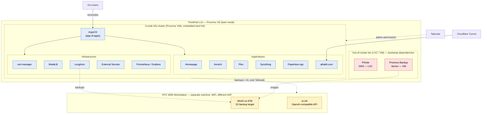
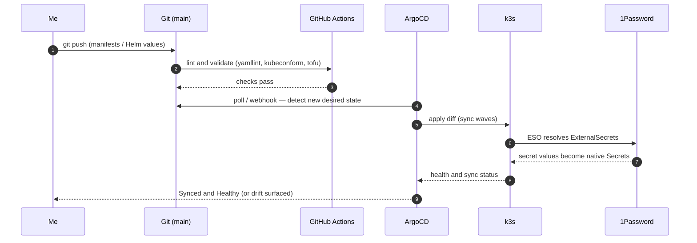
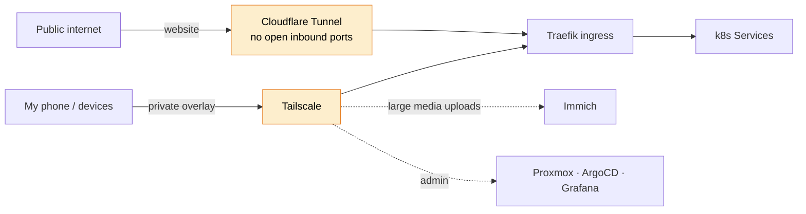
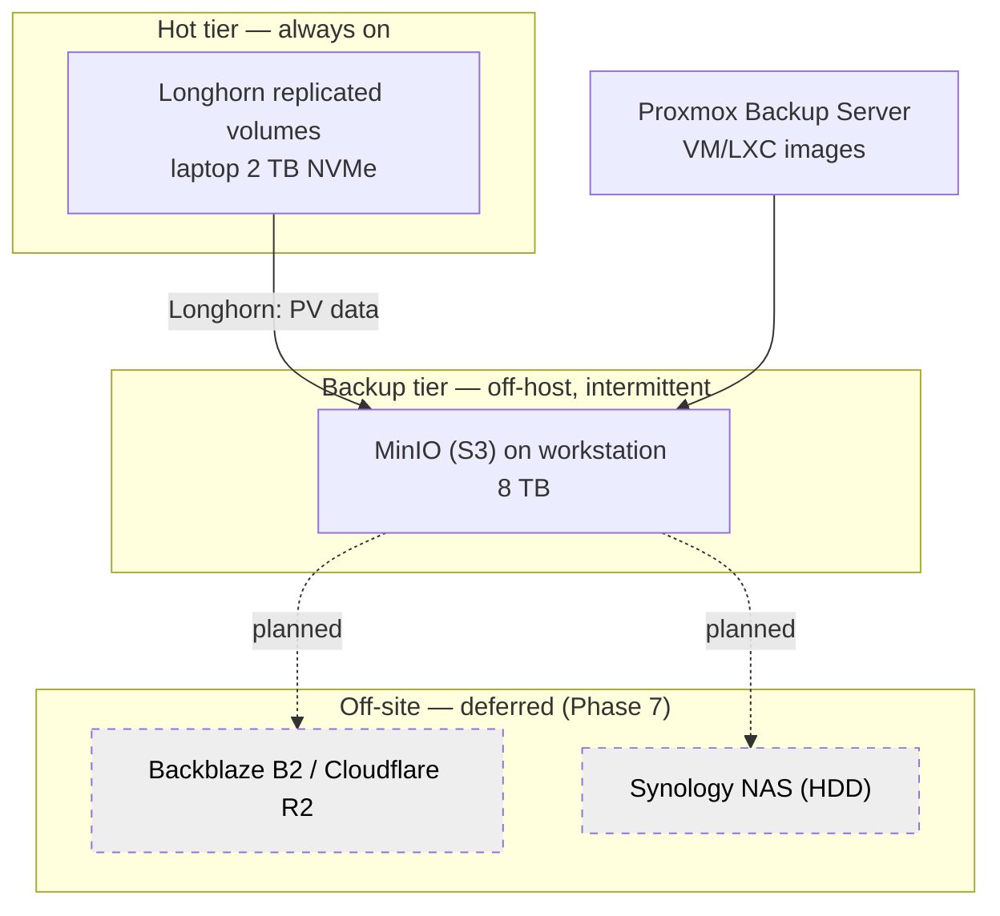

# Homelab

This repository is the full definition of my homelab: a ThinkPad running Proxmox VE, a three-node k3s cluster on top of it, and everything the cluster runs. VMs are provisioned with OpenTofu, nodes are configured with Ansible, and workloads are deployed through ArgoCD. Once the GitOps layer is up, a push to `main` is the only way the cluster changes.

I'm building it in phases ([roadmap](docs/roadmap.md)) because I want to actually understand each layer before putting the next one on top. Every foundational choice has an [ADR](docs/decisions/) explaining the context, the alternatives I considered, and why I picked what I picked.

One rule shapes most of the architecture: a service may run inside Kubernetes only if Kubernetes can start without it. DNS and backups sit outside the cluster because the cluster needs them to boot and to recover ([ADR-0003](docs/decisions/adr-0003-workload-placement.md)).

## Principles

1. Everything is declarative and lives in Git: provisioning (OpenTofu), configuration (Ansible), workloads (Kubernetes manifests reconciled by ArgoCD).
2. ArgoCD is the single source of truth for the cluster. It reconciles against `main` and surfaces drift.
3. Services run wherever they fit best. A small DNS resolver belongs in an LXC; a photo library belongs in the cluster.
4. Decisions get written down. Each ADR covers context, alternatives, the decision, and its consequences.
5. The build is phased. Each phase has exit criteria, and I verify them before moving on.

## Hardware

| | |
|---|---|
| **Server** | ThinkPad L14 Gen 4 — Intel 13th-gen, 64 GB RAM, 2 TB NVMe |
| **Power** | The laptop battery doubles as a UPS for graceful shutdown ([ADR-0001](docs/decisions/adr-0001-proxmox-hypervisor.md)) |
| **Backup target** | RTX 4090 workstation with an 8 TB NVMe running MinIO, reached over Tailscale ([ADR-0010](docs/decisions/adr-0010-workstation-integration.md)) |
| **Edge** | Cloudflare (DNS, Tunnel, WAF) in front of `alhabli.com` |
| **Later** | Synology NAS for bulk storage and an extra backup tier |

A laptop works well here. The battery buys time for a clean shutdown when power drops, and the machine idles at a few watts. In exchange, lid, sleep, and charge behaviour need active management — that setup is documented in [ADR-0001](docs/decisions/adr-0001-proxmox-hypervisor.md).

## Architecture


```mermaid
graph TB
    subgraph host["ThinkPad L14 — Proxmox VE (bare metal)"]
        direction TB

        subgraph oob["Out-of-cluster tier (LXC / VM) — bootstrap dependencies"]
            dns["PiHole<br/>DNS — LXC"]
            pbs["Proxmox Backup<br/>Server — VM"]
        end

        subgraph cluster["3-node k3s cluster (Proxmox VMs, embedded etcd HA)"]
            direction TB
            argo["ArgoCD<br/>(app-of-apps)"]

            subgraph infra["Infrastructure"]
                cm["cert-manager"]
                mlb["MetalLB"]
                lh["Longhorn"]
                eso["External Secrets"]
                obs["Prometheus / Grafana"]
            end

            subgraph apps["Applications"]
                home["Homepage"]
                immich["Immich"]
                plex["Plex"]
                sync["Syncthing"]
                paperless["Paperless-ngx"]
                web["alhabli.com"]
            end
        end
    end

    subgraph work["RTX 4090 Workstation — separate machine, WiFi, different NAT"]
        minio["MinIO on 8TB<br/>S3 backup target"]
        vllm["vLLM<br/>OpenAI-compatible API"]
    end

    git["Git (main)"] -->|reconciles| argo
    argo --> infra
    argo --> apps

    cf["Cloudflare Tunnel"] --> web
    ts["Tailscale"] -.admin and Immich.-> cluster
    cluster -.backups + AI, over Tailscale.-> work
    lh -.backups.-> minio
    pbs -.images.-> minio

    classDef out fill:#fde2e2,stroke:#c0392b,color:#000;
    classDef ink fill:#e2ecfd,stroke:#2c6fbb,color:#000;
    classDef ext fill:#fef3c7,stroke:#b7791f,color:#000;
    class dns,pbs out;
    class cm,mlb,lh,eso,obs,home,immich,plex,sync,paperless,web,argo ink;
    class minio,vllm ext;
```

PiHole and PBS sit at the Proxmox layer on purpose. The cluster resolves images and peers by name, so DNS has to exist before the cluster does, and backups have to survive the cluster being gone. This is what makes the lab safe to power off and back on without manual intervention.

The workstation is a separate machine on WiFi behind a different NAT than the ethernet-attached server. Bridging the router is out of scope, so the cluster reaches the MinIO backup target and the vLLM inference endpoint over Tailscale ([ADR-0010](docs/decisions/adr-0010-workstation-integration.md)).

## What runs where

| Workload | Placement | Why |
|---|---|---|
| PiHole / DNS | LXC, outside the cluster | The cluster needs DNS to pull images. A cold cluster can't pull a DNS pod's image if DNS is a pod. |
| Proxmox / PBS / core networking | Host / LXC | The substrate everything else runs on. |
| Monitoring (Prometheus, Grafana) | Kubernetes | Observes the cluster from within. Losing it while the cluster is down is acceptable. |
| Apps (Homepage, Immich, Plex, Syncthing, Paperless, website) | Kubernetes | Get self-healing, GitOps, ingress, and persistent volumes for free. |
| MinIO backup target, vLLM inference | Workstation, over Tailscale | The 8 TB disk and the GPU live on a separate machine behind a different NAT. |

## How changes reach the cluster


```mermaid
sequenceDiagram
    autonumber
    participant Me as Me
    participant Git as Git (main)
    participant CI as GitHub Actions
    participant Argo as ArgoCD
    participant K8s as k3s
    participant OP as 1Password

    Me->>Git: git push (manifests / Helm values)
    Git->>CI: lint and validate (yamllint, kubeconform, tofu)
    CI-->>Git: checks pass
    Argo->>Git: poll / webhook — detect new desired state
    Argo->>K8s: apply diff (sync waves)
    K8s->>OP: ESO resolves ExternalSecrets
    OP-->>K8s: secret values become native Secrets
    K8s-->>Argo: health and sync status
    Argo-->>Me: Synced and Healthy (or drift surfaced)
```

Nobody runs `kubectl apply` against the cluster. CI validates the change (the workflows land alongside the code they check, starting in Phase 1), ArgoCD makes the cluster match Git, and the External Secrets Operator pulls secret values from 1Password at sync time. The only encrypted material in the repo is a single SOPS+age bootstrap token ([ADR-0006](docs/decisions/adr-0006-secrets-management.md)).

## External access


```mermaid
graph LR
    pub["Public internet"] -->|website| cf["Cloudflare Tunnel<br/>no open inbound ports"]
    phone["My phone / devices"] -->|private overlay| tail["Tailscale"]

    cf --> traefik["Traefik ingress"]
    tail --> traefik
    tail -.->|large media uploads| immich["Immich"]
    tail -.->|admin| adminui["Proxmox · ArgoCD · Grafana"]
    traefik --> svc["k8s Services"]

    classDef edge fill:#fdeecd,stroke:#e67e22,color:#000;
    class cf,tail edge;
```

Access is split by audience ([ADR-0007](docs/decisions/adr-0007-cloudflare-tunnel.md)). The website goes out through a Cloudflare Tunnel, so no router ports are open and the home IP stays hidden. Admin surfaces and Immich ride Tailscale. Immich skips the Cloudflare proxy because the 100 MB request cap and the media terms would break photo and video uploads; over Tailscale the native Android app backs up in the background without those limits.

## Storage and backups


```mermaid
graph TB
    subgraph hot["Hot tier — always on"]
        lh["Longhorn replicated volumes<br/>laptop 2 TB NVMe"]
    end
    subgraph cold["Backup tier — off-host, intermittent"]
        minio["MinIO (S3) on workstation 8 TB"]
    end
    subgraph offsite["Off-site — deferred (Phase 7)"]
        cloud["Backblaze B2 / Cloudflare R2"]
        nas["Synology NAS (HDD)"]
    end

    lh -->|Longhorn: PV data| minio
    pbs["Proxmox Backup Server<br/>VM/LXC images"] --> minio
    minio -.planned.-> cloud
    minio -.planned.-> nas

    classDef plan stroke-dasharray: 5 5,fill:#eee,color:#000;
    class cloud,nas plan;
```

The backup strategy ([ADR-0009](docs/decisions/adr-0009-backup-strategy.md)) works toward 3-2-1 with a purpose-built tool per data shape: Longhorn backs up volumes, PBS backs up VM and LXC images, and Velero for cluster state comes later. Everything converges on the MinIO endpoint on the workstation, over Tailscale.

Two limits are worth being honest about. Longhorn's replicas all share one physical NVMe, so replication guards against a VM or OS failure and does nothing for the loss of that disk — that's what the off-host MinIO copy is for. And until the off-site tier lands in Phase 7, every copy of the data lives in the same home; that gap is a tracked, deliberate deferral.

## Stack

| Layer | Choice | ADR |
|---|---|---|
| Hypervisor | Proxmox VE on a laptop | [0001](docs/decisions/adr-0001-proxmox-hypervisor.md) |
| Kubernetes | k3s, HA with embedded etcd | [0002](docs/decisions/adr-0002-k3s-vs-talos.md) |
| Workload placement | Bootstrap-dependency rule | [0003](docs/decisions/adr-0003-workload-placement.md) |
| Provisioning | OpenTofu + `bpg/proxmox` | [0004](docs/decisions/adr-0004-opentofu-vs-terraform.md) |
| Configuration | Ansible + cloud-init | [0004](docs/decisions/adr-0004-opentofu-vs-terraform.md) |
| GitOps | ArgoCD, app-of-apps | [0005](docs/decisions/adr-0005-argocd-vs-flux.md) |
| Secrets | 1Password + External Secrets Operator, SOPS+age bootstrap | [0006](docs/decisions/adr-0006-secrets-management.md) |
| External access | Cloudflare Tunnel + Tailscale | [0007](docs/decisions/adr-0007-cloudflare-tunnel.md) |
| Networking | MetalLB + Traefik; Cilium later | [0007](docs/decisions/adr-0007-cloudflare-tunnel.md) |
| Storage | Longhorn | [0008](docs/decisions/adr-0008-longhorn-storage.md) |
| Backups | Longhorn + PBS + Velero to MinIO | [0009](docs/decisions/adr-0009-backup-strategy.md) |
| Observability | kube-prometheus-stack, trimmed | roadmap Phase 5 |
| GPU inference | vLLM on the workstation over Tailscale | [0010](docs/decisions/adr-0010-workstation-integration.md) |

## Repository layout

```
homelab/
├── docs/
│   ├── decisions/             # ADRs
│   ├── architecture/          # Diagrams
│   ├── runbooks/              # DR, provisioning, maintenance
│   ├── systems/               # How each system is actually set up
│   └── roadmap.md             # The phased build plan
├── tofu/                      # OpenTofu — Proxmox VM/LXC provisioning
│   ├── modules/
│   └── environments/homelab/
├── ansible/                   # Node hardening + k3s bootstrap
├── kubernetes/
│   ├── bootstrap/             # ArgoCD install + root app-of-apps
│   ├── infrastructure/        # metallb, longhorn, cert-manager, ESO, monitoring
│   └── apps/                  # immich, plex, homepage, ...
├── workstation/               # MinIO compose file for the backup target
└── .github/workflows/         # CI: lint + validate
```

Directories are scaffolded ahead of the phase that fills them in, so some of them currently hold only a README describing what will live there.

## Status

| Phase | Theme | Status |
|---|---|---|
| 0 | Foundation — docs, decisions, host | Done |
| 1 | IaC provisioning — OpenTofu + Ansible | In progress |
| 2 | Kubernetes + GitOps — k3s + ArgoCD | Not started |
| 3 | Minimum platform — MetalLB, Longhorn, Tailscale, MinIO backups | Not started |
| 4 | First apps — Homepage, Plex, qBittorrent, Syncthing, Immich | Not started |
| 5 | Exposure and observability — TLS, tunnel, Grafana, website | Not started |
| 6 | Further apps — Paperless, n8n, Open WebUI, vLLM | Not started |
| 7 | Advanced — Cilium, Vault, off-site backups, DR rehearsal | Not started |

Apps land in Phase 4 on a deliberately minimal platform slice, so the lab becomes useful well before the platform is finished. Deliverables and exit criteria per phase are in [docs/roadmap.md](docs/roadmap.md); work is tracked as GitHub issues under per-phase milestones.
