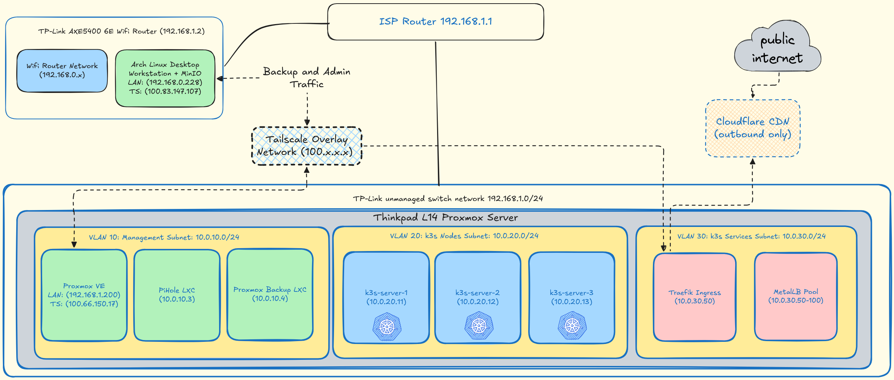

# Network & Platform Architecture

## The Addressing Contract

The homelab is built on a ThinkPad L14 running Proxmox VE, which sits on the `192.168.1.x` LAN network. To ensure strict isolation between management interfaces, compute nodes, and exposed services, the internal virtual network is segmented into three distinct VLANs:

* **VLAN 10 (Management - `10.0.10.0/24`):** Core infrastructure that must remain available even if the Kubernetes cluster goes down (Proxmox VE, PiHole DNS, Proxmox Backup Server).
* **VLAN 20 (Compute - `10.0.20.0/24`):** The k3s Kubernetes nodes. Isolated to contain broadcast noise and restrict unauthorized lateral movement.
* **VLAN 30 (Services - `10.0.30.0/24`):** The MetalLB IP pool and Traefik Ingress. This is the "front door" where all incoming requests land before being routed into the cluster.

---

## Architecture Note: The Tailscale Overlay

**Why Tailscale?**
Due to the physical double-NAT topology of the home network (the WiFi network on `192.168.0.x` and the Homelab LAN on `192.168.1.x`), direct routing between the Admin Desktop and the Proxmox Server is blocked by the WiFi router's hardware firewall. 

To solve this securely without modifying router firewalls or opening inbound ports, **Tailscale** is used as a zero-config WireGuard overlay network. It provides a secure, encrypted tunnel that bridges the `0.x` and `1.x` physical networks. 

All administrative traffic (Proxmox UI, SSH) and large media uploads (Immich) are routed exclusively over this `100.x.x.x` overlay. This completely bypasses Cloudflare's 100MB proxy limits while keeping the internal cluster services completely hidden from the public internet.
