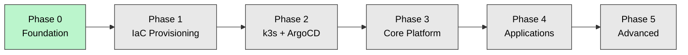

# Homelab Roadmap

A phased build plan. The point of phasing is judgment: a homelab can be an endless pile of half-finished services, or it can be a platform that tells a complete, working story at every stage. Each phase below has a **goal**, concrete **deliverables**, and **exit criteria** — I don't move on until the current phase actually works and is documented.

Phases map to GitHub milestones; work is tracked as issues under each.

> **Legend:** ✅ done · 🚧 in progress · ⬜ not started

---

## Status at a glance

| Phase | Theme | Status |
|---|---|---|
| **0** | Foundation — docs, decisions, host | ✅ |
| **1** | IaC provisioning — OpenTofu + Ansible | ⬜ |
| **2** | Kubernetes + GitOps — k3s + ArgoCD | ⬜ |
| **3** | Core platform — networking, storage, secrets, TLS, observability | ⬜ |
| **4** | Applications — the services I actually use | ⬜ |
| **5** | Advanced — the deep-learning stretch | ⬜ |

---

## Phase 0 — Foundation 🚧

> **Goal:** A repo that reads as a deliberate, well-reasoned platform — and a host ready to build on — *before* writing a line of provisioning code.

**Deliverables**
- Architecture Decision Records for every foundational choice ([ADR index](#decision-records)).
- The hero `README.md`: philosophy, architecture diagrams, stack table, this roadmap.
- This roadmap and the docs backbone (`docs/architecture`, `docs/runbooks`).
- Proxmox VE installed on the ThinkPad ([ADR-0001](decisions/adr-0001-proxmox-hypervisor.md)), with laptop-as-UPS power handling (lid/logind, `tlp` charge thresholds).
- A network plan documented as a diagram.
- PiHole on an LXC and Proxmox Backup Server standing up ([ADR-0003](decisions/adr-0003-workload-placement.md) — these live *outside* the cluster on purpose).

**Exit criteria**
- The repo renders cleanly on GitHub (diagrams display, links resolve) and tells a coherent story top-to-bottom.
- DNS resolves from the PiHole LXC; the host survives a lid-close and an AC-unplug without sleeping or hard-stopping.

---

## Phase 1 — IaC Provisioning ⬜

> **Goal:** No click-ops. The entire VM/LXC topology is reproducible from code.

**Deliverables**
- A cloud-init VM template baked on Proxmox.
- OpenTofu modules (`vm`, `lxc`, `k3s-node`) and a `homelab` environment that provisions the three k3s VMs ([ADR-0004](decisions/adr-0004-opentofu-vs-terraform.md)) via the `bpg/proxmox` provider.
- Ansible roles (`base-hardening`, `common`, `k3s-server`, `k3s-agent`) and inventory — the **OpenTofu-creates / Ansible-configures** seam.
- A remote/encrypted state backend for OpenTofu.

**Exit criteria**
- `tofu apply` produces three reachable, hardened VMs from nothing; `tofu destroy` + re-apply reproduces them faithfully.
- `open-iscsi` and node prerequisites are in place for Longhorn (Phase 3) via the Ansible base role.

---

## Phase 2 — Kubernetes + GitOps ⬜

> **Goal:** A push to `main` is the only way to change the cluster.

**Deliverables**
- k3s installed across the three nodes ([ADR-0002](decisions/adr-0002-k3s-vs-talos.md)) with embedded etcd HA; `servicelb` disabled (MetalLB comes in Phase 3), Traefik retained.
- ArgoCD bootstrapped with the **app-of-apps** root ([ADR-0005](decisions/adr-0005-argocd-vs-flux.md)).
- The **secrets bootstrap chain**: a SOPS+age-encrypted 1Password service-account token committed to Git, External Secrets Operator installed, first `ExternalSecret` resolving from 1Password ([ADR-0006](decisions/adr-0006-secrets-management.md)).
- A first trivial app deployed end-to-end through GitOps as a pattern to replicate.

**Exit criteria**
- Deleting a workload in the cluster and watching ArgoCD restore it from Git.
- A secret appears in the cluster having originated in 1Password, with no plaintext or ciphertext in the repo beyond the single bootstrap token.

---

## Phase 3 — Core Platform ⬜

> **Goal:** The platform services that everything else depends on — networking, storage, TLS, exposure, and observability.

**Deliverables**
- **MetalLB** providing real LoadBalancer IPs from a dedicated pool.
- **Longhorn** as the default replicated `StorageClass` ([ADR-0008](decisions/adr-0008-longhorn-storage.md)).
- **cert-manager** issuing TLS via Let's Encrypt **DNS-01** against Cloudflare.
- **external-dns** + **Cloudflare Tunnel** for the public tier, **Tailscale** for admin/private ([ADR-0007](decisions/adr-0007-cloudflare-tunnel.md)).
- **MinIO** on the workstation 8 TB as the unified S3 backup target ([ADR-0009](decisions/adr-0009-backup-strategy.md)).
- **Observability:** kube-prometheus-stack (Prometheus, Grafana, Alertmanager) + Loki + Alloy/Promtail.

**Exit criteria**
- A service is reachable at `*.alhabli.com` over valid TLS with no inbound router ports open.
- Grafana shows cluster + node metrics and logs; an alert fires on a deliberately-broken target.
- A Longhorn volume backup lands in MinIO and restores successfully.

---

## Phase 4 — Applications ⬜

> **Goal:** The services I actually use, deployed the same disciplined way as the platform.

**Deliverables**
- **Immich** — photo/video library on Longhorn, reached via Tailscale (native Android app, background backup), backed up per the 3-2-1 plan ([ADR-0007](decisions/adr-0007-cloudflare-tunnel.md) / [ADR-0009](decisions/adr-0009-backup-strategy.md)).
- **Paperless-ngx** — document management on persistent storage.
- **Syncthing** — for game saves across OSs and Obsidian notes across devices (sync, explicitly *not* backup).
- **alhabli.com** — the personal website, served via Cloudflare Tunnel.
- Curated Grafana dashboards for the above.

**Exit criteria**
- A photo taken on the phone appears in Immich automatically over Tailscale.
- The website is publicly reachable; every app is a GitOps `Application` with backups configured.

---

## Phase 5 — Advanced (the deep-learning stretch) ⬜

> **Goal:** The "because I want to learn it properly" tier — adopted only once the platform underneath is stable.

**Deliverables**
- **Cilium** replacing flannel as the CNI (eBPF, network policy, Hubble observability).
- **Off-site backups** — fill the deferred 3-2-1 slot with a cloud S3 target (Backblaze B2 / Cloudflare R2), and add the Synology NAS as a spinning-disk local copy.
- **Velero** restore drills wired into a documented DR runbook.
- **HashiCorp Vault** behind ESO for dynamic secrets.
- **Argo Rollouts** for progressive delivery; **Kyverno/OPA** for policy-as-code.

**Exit criteria**
- A full disaster-recovery rehearsal: rebuild from PBS + Git + backups and bring the lab back from cold.
- Network policies enforced and visualized in Hubble; off-site restore verified end-to-end.

---

## Decision Records

| ADR | Decision |
|---|---|
| [0001](decisions/adr-0001-proxmox-hypervisor.md) | Proxmox VE on a laptop (battery-as-UPS) |
| [0002](decisions/adr-0002-k3s-vs-talos.md) | k3s over vanilla k8s / Talos |
| [0003](decisions/adr-0003-workload-placement.md) | What runs in Kubernetes vs. LXC/VM |
| [0004](decisions/adr-0004-opentofu-vs-terraform.md) | OpenTofu over Terraform |
| [0005](decisions/adr-0005-argocd-vs-flux.md) | ArgoCD + app-of-apps over Flux |
| [0006](decisions/adr-0006-secrets-management.md) | 1Password + ESO, SOPS+age bootstrap tier |
| [0007](decisions/adr-0007-cloudflare-tunnel.md) | Tiered external access (Cloudflare Tunnel + Tailscale) |
| [0008](decisions/adr-0008-longhorn-storage.md) | Longhorn for replicated persistent storage |
| [0009](decisions/adr-0009-backup-strategy.md) | Layered 3-2-1 backup strategy |

---

## Open follow-ups (decide at build time, non-blocking)
- Ingress controller: retain Traefik (k3s default) vs. ingress-nginx — decide in Phase 3.
- Start at 3 HA servers immediately vs. grow into HA from 1 server — resource/comfort call.
- Off-site cloud provider for backups (B2 vs. R2) — deferred to Phase 5.
- When to migrate cold Immich media to an NFS tier on the future NAS.
