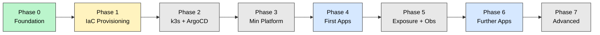

# Homelab Roadmap

A phased build plan. The point of phasing is judgment: a homelab can be an endless pile of half-finished services, or it can be a platform that tells a complete, working story at every stage. Each phase below has a **goal**, concrete **deliverables**, and **exit criteria** — I don't move on until the current phase actually works and is documented.

Phases map to GitHub milestones; work is tracked as issues under each.

> **Legend:** [Done] · [In Progress] · [Not Started]

---

## Status at a glance

| Phase | Theme | Status |
|---|---|---|
| **0** | Foundation — docs, decisions, host | [Done] |
| **1** | IaC provisioning — OpenTofu + Ansible | [In Progress] |
| **2** | Kubernetes + GitOps — k3s + ArgoCD | [Not Started] |
| **3** | Minimum platform for apps — MetalLB, Longhorn, Tailscale, MinIO backups over the LAN | [Not Started] |
| **4** | First applications — Homepage, Plex, qBittorrent, Syncthing, Immich | [Not Started] |
| **5** | Exposure, observability, backups — TLS, tunnel, Grafana, website | [Not Started] |
| **6** | Further applications — Paperless, n8n, Open WebUI, vLLM | [Not Started] |
| **7** | Advanced — the deep-learning stretch | [Not Started] |

The ordering is deliberate: the IaC and GitOps foundation (Phases 1–2) comes first and in full, because everything else depends on it. But rather than finish the entire platform before deploying anything usable, the platform is split by *minimum dependency*. Phase 3 builds only the slice an app actually needs to run and be reached privately, Phase 4 puts the daily-use apps on it, and the rest of the platform — public exposure, observability, backups off-site — follows in Phases 5 onward. The lab becomes useful at Phase 4 while the learning path stays intact.

```mermaid
graph LR
    P0["Phase 0<br/>Foundation"] --> P1["Phase 1<br/>IaC Provisioning"]
    P1 --> P2["Phase 2<br/>k3s + ArgoCD"]
    P2 --> P3["Phase 3<br/>Min Platform"]
    P3 --> P4["Phase 4<br/>First Apps"]
    P4 --> P5["Phase 5<br/>Exposure + Obs"]
    P5 --> P6["Phase 6<br/>Further Apps"]
    P6 --> P7["Phase 7<br/>Advanced"]

    style P0 fill:#bbf5cc,stroke:#333,color:#000
    style P1 fill:#fff3bf,stroke:#333,color:#000
    style P2 fill:#e8e8e8,stroke:#333,color:#000
    style P3 fill:#e8e8e8,stroke:#333,color:#000
    style P4 fill:#d6e8ff,stroke:#333,color:#000
    style P5 fill:#e8e8e8,stroke:#333,color:#000
    style P6 fill:#d6e8ff,stroke:#333,color:#000
    style P7 fill:#e8e8e8,stroke:#333,color:#000
```

---

## Phase 0 — Foundation [Done]

> **Goal:** A repo that reads as a deliberate, well-reasoned platform — and a host ready to build on — *before* writing a line of provisioning code.

**Deliverables**
- Architecture Decision Records for every foundational choice ([ADR index](#decision-records)).
- The hero `README.md`: philosophy, architecture diagrams, stack table, this roadmap.
- This roadmap and the docs backbone (`docs/architecture`, `docs/runbooks`).
- Proxmox VE installed on the ThinkPad ([ADR-0001](decisions/adr-0001-proxmox-hypervisor.md)), with laptop-as-UPS power handling (lid/logind, `tlp` charge thresholds).
- A network plan documented as a diagram.
- PiHole on an LXC and Proxmox Backup Server standing up ([ADR-0003](decisions/adr-0003-workload-placement.md) — these live *outside* the cluster on purpose).

**Exit criteria**
- The repo renders cleanly on GitHub (diagrams display, links resolve) and tells a coherent story top-to-bottom.
- DNS resolves from the PiHole LXC; the host survives a lid-close and an AC-unplug without sleeping or hard-stopping.

---

## Phase 1 — IaC Provisioning [In Progress]

> **Goal:** No click-ops. The entire VM/LXC topology is reproducible from code.

**Deliverables**
- A cloud-init VM template baked on Proxmox.
- OpenTofu modules (`vm`, `lxc`, `k3s-node`) and a `homelab` environment that provisions the three k3s VMs ([ADR-0004](decisions/adr-0004-opentofu-vs-terraform.md)) via the `bpg/proxmox` provider.
- Ansible roles (`base-hardening`, `common`) and inventory — the **OpenTofu-creates / Ansible-configures** seam. The `k3s-server` and `k3s-agent` roles move to Phase 2, where they can actually be exercised and verified.
- A remote/encrypted state backend for OpenTofu.
- CI on every PR: `tofu fmt`/`tofu validate`, tflint, and ansible-lint, plus Renovate for dependency updates.

**Exit criteria**
- `tofu apply` produces three reachable, hardened VMs from nothing; `tofu destroy` + re-apply reproduces them faithfully.
- `open-iscsi` and node prerequisites are in place for Longhorn (Phase 3) via the Ansible base role.

---

## Phase 2 — Kubernetes + GitOps [Not Started]

> **Goal:** A push to `main` is the only way to change the cluster.

**Deliverables**
- The Ansible `k3s-server` and `k3s-agent` roles, and k3s installed with them across the three nodes ([ADR-0002](decisions/adr-0002-k3s-vs-talos.md)) with embedded etcd HA; `servicelb` disabled (MetalLB comes in Phase 3), Traefik retained.
- ArgoCD bootstrapped with the **app-of-apps** root ([ADR-0005](decisions/adr-0005-argocd-vs-flux.md)).
- The **secrets bootstrap chain**: a SOPS+age-encrypted 1Password service-account token committed to Git, External Secrets Operator installed, first `ExternalSecret` resolving from 1Password ([ADR-0006](decisions/adr-0006-secrets-management.md)).
- A first trivial app deployed end-to-end through GitOps as a pattern to replicate (verified via port-forward — there is no LoadBalancer until MetalLB lands in Phase 3).
- CI extended to the manifests: yamllint and kubeconform on every PR.

**Exit criteria**
- Deleting a workload in the cluster and watching ArgoCD restore it from Git.
- A secret appears in the cluster having originated in 1Password, with no plaintext or ciphertext in the repo beyond the single bootstrap token.

---

## Phase 3 — Minimum Platform for Apps [Not Started]

> **Goal:** The smallest platform slice that lets a stateful app run and be reached privately — so real apps can land in Phase 4 without waiting for the entire platform.

**Deliverables**
- **MetalLB** providing real LoadBalancer IPs from a dedicated pool.
- **Longhorn** as the default replicated `StorageClass` ([ADR-0008](decisions/adr-0008-longhorn-storage.md)).
- **Tailscale** for the private/admin tier, reaching the lab from off-network ([ADR-0007](decisions/adr-0007-cloudflare-tunnel.md)). It is no longer the transport to the workstation, which is now on the same L2 segment ([ADR-0011](decisions/adr-0011-flat-l2-network.md)).
- The **ingress controller** decision resolved (Traefik vs ingress-nginx) and wired in.
- **MinIO** on the workstation 8 TB as the S3 backup target, reached over the LAN, with **Longhorn volume backups** wired to it ([ADR-0009](decisions/adr-0009-backup-strategy.md) / [ADR-0011](decisions/adr-0011-flat-l2-network.md)).
- A **stable address for the workstation** — a DHCP reservation or a PiHole local DNS record — so backup targets and the OpenTofu backend stop depending on a lease ([ADR-0011](decisions/adr-0011-flat-l2-network.md)).
- **Host firewall and bind addresses on the workstation**, replacing the LAN isolation that the Tailscale-only binding used to provide ([ADR-0011](decisions/adr-0011-flat-l2-network.md)).

**Exit criteria**
- A `Service` of type LoadBalancer gets a MetalLB IP and is reachable.
- A PVC binds and a pod mounts a replicated Longhorn volume.
- A Longhorn volume backup lands in MinIO over the LAN and restores successfully.
- MinIO and vLLM refuse connections from a device on the LAN that is not the cluster or the admin workstation.

---

## Phase 4 — First Applications [Not Started]

> **Goal:** The first daily-use apps, on Longhorn and reached privately over Tailscale. This is where the lab starts earning its keep — with backups already in place from Phase 3, before real data accumulates.

**Deliverables**
- **[Homepage](https://github.com/gethomepage/homepage)** — the central dashboard and entry point, deployed first as a single pane over everything else.
- **[Immich](https://github.com/immich-app/immich)** — photo/video library on Longhorn, reached via Tailscale (native Android app, background backup), backed up per the 3-2-1 plan ([ADR-0007](decisions/adr-0007-cloudflare-tunnel.md) / [ADR-0009](decisions/adr-0009-backup-strategy.md)).
- **[Plex](https://github.com/linuxserver/docker-plex)** — media server using the ThinkPad's 13th-gen Intel QuickSync for hardware transcoding.
- **[qBittorrent](https://github.com/qbittorrent/qBittorrent)** — torrent client for Linux ISOs and media acquisition, sharing the media volume with Plex.
- **[Syncthing](https://github.com/syncthing/syncthing)** — game saves across OSs and Obsidian notes across devices (sync, explicitly *not* backup).

**Exit criteria**
- A photo taken on the phone appears in Immich automatically over Tailscale, and is covered by a backup.
- Plex plays a library item with hardware transcode; Homepage links resolve to the other apps.
- Every app is a GitOps `Application`.

---

## Phase 5 — Exposure, Observability & Backups [Not Started]

> **Goal:** Public exposure and operational maturity, layered on once apps are running — the parts that harden and observe the lab rather than block its use.

**Deliverables**
- **cert-manager** issuing TLS via Let's Encrypt **DNS-01** against Cloudflare.
- **external-dns** + **Cloudflare Tunnel** for the public tier ([ADR-0007](decisions/adr-0007-cloudflare-tunnel.md)).
- **Observability**, kept lean and Grafana-centred: a trimmed kube-prometheus-stack (Prometheus + Grafana + Alertmanager). The heavier log pipeline (Loki + Alloy) is deferred to Phase 7 unless a clear need appears.
- Curated Grafana dashboards for the deployed apps.
- **alhabli.com** — the personal website, served publicly via Cloudflare Tunnel.
- **Off-site copy of the Immich backups** (Backblaze B2 / Cloudflare R2). The full off-site tier stays in Phase 7, but photos are irreplaceable and both existing copies live in the same home — this closes that gap early for the data that matters most.

**Exit criteria**
- A service is reachable at `*.alhabli.com` over valid TLS with no inbound router ports open.
- Grafana shows cluster + node metrics; an alert fires on a deliberately-broken target.
- The website is publicly reachable; every Phase 5 service is a GitOps `Application`.
- The Immich backup bucket replicates off-site, and a restore from the off-site copy succeeds.

---

## Phase 6 — Further Applications [Not Started]

> **Goal:** The heavier apps and the AI stack, deployed once public exposure and observability exist.

**Deliverables**
- **[Paperless-ngx](https://github.com/paperless-ngx/paperless-ngx)** — document management (OCR, Postgres, Redis, Tika) on persistent storage.
- **[n8n](https://github.com/n8n-io/n8n)** — workflow automation orchestrating the AI content pipeline and site-visitor interactions.
- **[Open WebUI](https://github.com/open-webui/open-webui)** — chat front-end wired to the external vLLM endpoint.
- **Distributed AI (external)** — **[vLLM](https://github.com/vllm-project/vllm)** runs bare-metal on the RTX 4090 workstation to use the GPU directly, serving an OpenAI-compatible API back to the cluster over the LAN ([ADR-0011](decisions/adr-0011-flat-l2-network.md)). The workstation is a separate machine from the ThinkPad homelab server, sharing the same L2 segment. (Image generation via ComfyUI is a possible future addition.)

**Exit criteria**
- Paperless ingests and OCRs a document on persistent storage.
- n8n runs a workflow that calls the vLLM endpoint over the LAN; Open WebUI completes a chat via vLLM.
- Every Phase 6 app is a GitOps `Application` with backups configured.

---

## Phase 7 — Advanced (the deep-learning stretch) [Not Started]

> **Goal:** The "because I want to learn it properly" tier — adopted only once the platform underneath is stable.

**Deliverables**
- **Cilium** replacing flannel as the CNI (eBPF, network policy, Hubble observability).
- **Off-site backups** — fill the deferred 3-2-1 slot with a cloud S3 target (Backblaze B2 / Cloudflare R2), and add the Synology NAS as a spinning-disk local copy.
- **Velero** restore drills wired into a documented DR runbook.
- **HashiCorp Vault** behind ESO for dynamic secrets.
- **Argo Rollouts** for progressive delivery; **Kyverno/OPA** for policy-as-code.

**Exit criteria**
- A full disaster-recovery rehearsal: rebuild from PBS + Git + backups and bring the lab back from cold.
- Network policies enforced and visualized in Hubble; off-site restore verified end-to-end.

---

## Decision Records

| ADR | Decision |
|---|---|
| [0001](decisions/adr-0001-proxmox-hypervisor.md) | Proxmox VE on a laptop (battery-as-UPS) |
| [0002](decisions/adr-0002-k3s-vs-talos.md) | k3s over vanilla k8s / Talos |
| [0003](decisions/adr-0003-workload-placement.md) | What runs in Kubernetes vs. LXC/VM |
| [0004](decisions/adr-0004-opentofu-vs-terraform.md) | OpenTofu over Terraform |
| [0005](decisions/adr-0005-argocd-vs-flux.md) | ArgoCD + app-of-apps over Flux |
| [0006](decisions/adr-0006-secrets-management.md) | 1Password + ESO, SOPS+age bootstrap tier |
| [0007](decisions/adr-0007-cloudflare-tunnel.md) | Tiered external access (Cloudflare Tunnel + Tailscale) |
| [0008](decisions/adr-0008-longhorn-storage.md) | Longhorn for replicated persistent storage |
| [0009](decisions/adr-0009-backup-strategy.md) | Layered 3-2-1 backup strategy |
| [0010](decisions/adr-0010-workstation-integration.md) | Workstation (GPU + 8 TB) integrated over Tailscale across a separate NAT *(superseded by 0011)* |
| [0011](decisions/adr-0011-flat-l2-network.md) | Flat L2 network for workstation and homelab on a dedicated switch |

---

## Open follow-ups (decide at build time, non-blocking)
- Ingress controller: retain Traefik (k3s default) vs. ingress-nginx — decide in Phase 3.
- Start at 3 HA servers immediately vs. grow into HA from 1 server — resource/comfort call.
- Off-site cloud provider for backups (B2 vs. R2) — the Immich bucket replicates off-site in Phase 5; the full off-site tier is deferred to Phase 7.
- Whether Phase 3 should include a minimal monitoring slice (node-exporter plus a Longhorn volume-health alert) so stateful apps don't run blind until Phase 5.
- When to migrate cold Immich media to an NFS tier on the future NAS.
- Whether to add ComfyUI (image generation) alongside vLLM on the workstation — future.
